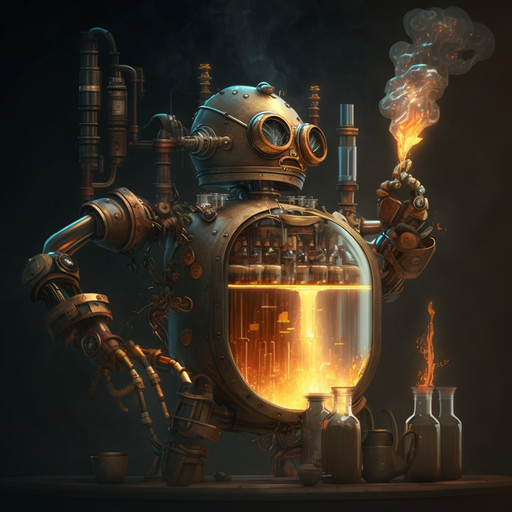

<!--  -->
<p align="center">
  
  <br>
  "The distillation process with a robot, scifi, future, detail, high resolution, 8k" by Midjourney
</p>

# DISCO: Distilling Phrasal Counterfactuals with Large Language Models

This is the public codebase for arxiv paper: [DISCO: Distilling Counterfactuals with Large Language Models](https://arxiv.org/abs/2212.10534)


## About DISCO
DISCO is a framework for automatically generating high-quality counterfactual data at scale. The system elicite counterfactual perturbations by prompting a large general language model like GPT-3. Then, a task-specific teacher model filters the generation to distill high-quality counterfactual data. 

We find that learning with this counterfactual data yields a comparatively small student model that is 6% (absolute) more robust and generalizes 5% better across distributions than baselines on various challenging evaluations. This model is also 15% more sensitive in differentiating original and counterfactual examples, on three evaluation sets written by human workers and via human-AI collaboration.

## Features TODO
- [ ] Build demonstrations into prompt format automaticlly when loading examples from the disk.
- [ ] Enable KNN-and-sentence-embedding-based demonstration search.
- [ ] Enable reinforcement learning for demonstration search.
- [ ] Add option to turn on & off database features.
- [ ] Add prompt supports for Single-Sentence-Classification (ex, sentiment analysis).
- [ ] Return top-5 log-likelihood from OpenAI API calls.


## Install MongoDB
Following the instruction [here](https://www.prisma.io/dataguide/mongodb/setting-up-a-local-mongodb-database#setting-up-mongodb-on-macos) to install MongoDB local server on your machine. Also install MongoDB Compass for user-friendly database management. [Download](https://www.mongodb.com/try/download/compass) the version propoer to your operating system.


## Requirements

```
python==3.10.9
numpy==1.24.2
openai==0.27.0
torch==2.0.1
transformers==4.26.1
hydra-core==1.3.2
pymongo==4.3.3
sentence-transformers==2.2.2
```

Install all required python dependencies:

```
pip install -r requirements.txt
```

For any other packages that may be required, please see the error messages and install accordingly.

## Run LLM Counterfactual Distillation

We use [**Hydra**](https://hydra.cc/docs/intro/) to dynamically manage the configurations for the distillation pipeline. First, take a look at the `config.yaml` file loacted under the `config` folder. Set the argumentes required for your running and experiment:

```yaml
# paths:
  data_dir: ./data/                   # path to the data directory, default to ./data

# data_params:
  dataset: snli                       # base dataset for conterfactual generation
  task_name: snli                     # the type of task defined in prompt.retrieval
  start: 0                            # start position of the dataset for the current batch
  end: 11                             # end position of the dataset for the current batch
  template_name: masked_cad_premise   # template name for counterfactual generation 
  source_label: entailment            # source label for counterfactual generation
  target_label: neutral               # target label for counterfactual generation

# generator_params:
  gen_type: completion                # gpt-3 generation mode: completion | insertion | chat
  model_name: gpt-3-003               # engine name: gpt-3-003 | gpt-3-002 | chatgpt | gpt-4
  overgenerate: True                  # more than 1 generations for an input data
  no_demo: False                      # zero-shop generation without in-context examples

# search_params: 
  num_neighbors: 8                             # number of nearest neighbors
  embed_type: CLS                              # type of embedding method
  metric: euclidean                            # distance metric for nearest neighbor
  encoder_name: roberta-large-nli-mean-tokens  # encoder name for sentence embedding
  prompt_search: False                         # enable dynamic demonstration selection 

# filter_params:
  filter_all: Flase                    # filter all previous generation outputs
```

Next, to run the distillation pipeline, execute:

```bash
python run.py
```

To run filtering on all previous generated outputs, set `filter_all` to `False` in the config file and re-execute:
```bash
python run.py
```

## Generated DISCO Data
- You can find the DISCO augmentation data used for our experiments here: `data/disco.jsonl`
- For a more extensive set of counterfactual data, you can take a look at the `data/augment` folder
- Feel free to generate and filter more counterfactual data using the pipeline.

## License

[](https://lbesson.mit-license.org/)

This work is licensed under a [MIT License](http://creativecommons.org/licenses/by-nc-sa/4.0/).

[](https://creativecommons.org/licenses/by-sa/4.0/)

<!-- The **DISCO** augmentation dataset is licensed under a [Creative Commons Attribution-NonCommercial-ShareAlike 4.0 International License](http://creativecommons.org/licenses/by-nc-sa/4.0/). -->


## Cite

If you find that our paper, code, or the dataset inspire you, please cite us:

```bibtex
@misc{chen2022disco,
      title={DISCO: Distilling Phrasal Counterfactuals with Large Language Models}, 
      author={Zeming Chen and Qiyue Gao and Kyle Richardson and Antoine Bosselut and Ashish Sabharwal},
      year={2022},
      eprint={2212.10534},
      archivePrefix={arXiv},
      primaryClass={cs.CL}
}
```
